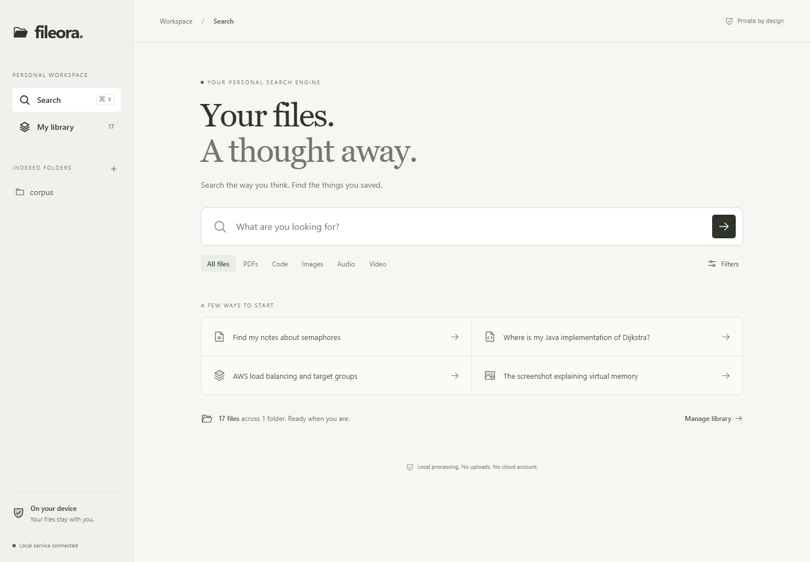

# Fileora

**Local Multimodal Personal Search Engine** — find a note, PDF page, PowerPoint slide, code function, screenshot, or lecture moment using the way you remember it.

Fileora runs on your computer with a React workspace and a FastAPI service. SQLite stores the catalog, passages, provenance, and normalized vectors; FAISS provides recoverable exact vector search. There are no paid APIs, accounts, telemetry, or runtime model downloads.



## Run on Windows

Prerequisites: Python 3.11–3.13, Node.js 20.19+ or 22.12+, and an internet connection for initial package/model installation. Python 3.11 is the version validated on this machine. CPU inference is the reproducible default; a GPU is optional.

From the project directory in PowerShell:

```powershell
powershell -NoProfile -ExecutionPolicy Bypass -File scripts/setup.ps1 -Demo
powershell -NoProfile -ExecutionPolicy Bypass -File scripts/start.ps1
```

Open **http://127.0.0.1:8765**. Select **My library**, paste an absolute folder path, and rescan. Only selected folders are read. Press Ctrl+K to search. Select a match to inspect the evidence and open its source.

For V2 automatic updates, enable **Watch folders** in **My library**. Fileora saves the choice in this catalog and restores it on the next normal launch. While the app is running, it notices edits, new files, renames, and deletions; a full verification catches missed events every 15 minutes. The Library shows whether native watching is active or periodic scans are being used. Automatic updates start off for a new catalog. Disabling them lets an already queued/running scan finish. See the [V2 milestone and checks](docs/v2.md).

Setup installs locked dependencies, prepares MiniLM and CLIP locally, builds the frontend, and installs portable English OCR. `-Demo` registers the authored sample corpus. `-NoModels` skips model downloads for lexical-only use. `-Media` also installs the media dependencies, Whisper, and the optional synthetic lecture fixture generator. Nothing changes the machine's execution policy: the command's `Bypass` applies only to that PowerShell process.

The scripts keep catalog, model files, indexes, previews, and tool caches inside `.fileora/`. Stop the server with Ctrl+C. One process owns each catalog; stop the server before using catalog commands in the terminal.

Run setup before startup. If setup reports that `fileora.exe` is being used by another process, or startup says the catalog is in use, an existing Fileora process is still running. Press Ctrl+C in its terminal, wait for it to exit, then rerun setup followed by startup. Setup and startup check for these locks before proceeding. A leftover `.fileora/instance.lock` file is normal: do not delete it to bypass a running process.

## What works

| Version | Implemented behavior |
| --- | --- |
| V1: text search | TXT, UTF-8/UTF-16 Markdown, text PDFs; token-aware overlapping passages; MiniLM semantic retrieval; PDF page and text line provenance |
| V2: maintainable search | SQLite FTS5 BM25 + semantic RRF; Java/Python Tree-sitter functions; other code line fallback; incremental SHA-256 caching; rename/delete reconciliation; jobs, cancellation, Watchdog, filters, optional cross-encoder reranking |
| V3: images | PNG/JPEG thumbnails, offline Tesseract OCR with word boxes, scanned PDF page OCR, CLIP text-to-image retrieval, weighted file-level multimodal fusion |
| V4: media (opt-in) | WAV/MP3/FLAC, MP4/MKV; local faster-whisper base.en with timestamps; sampled video frames with duplicate suppression and OCR/CLIP; native media preview seeking |
| V5: answers (optional Ollama) | Local `qwen3:4b`, bounded retrieved excerpts, evidence IDs, citation validation, explicit unsupported/refusal responses; retrieval works when Ollama is absent |

Every result includes a source path and its supporting passage, page, line range, or time interval. Default hybrid searches with one meaningful term (such as `BCNF`) require a literal text, OCR, filename, or symbol match. Longer queries retain semantic paraphrases while rejecting weak vector neighbors and incidental one-word lexical hits. Results distinguish term matches, meaning-based matches, and visual similarity. Select **Semantic** in Filters to explore related concepts for a single word; **Exact terms** uses literal OR-term retrieval. Scores rank candidates; they are **not confidence probabilities**. Verify the original evidence, especially for generated answers.

## PowerPoint search

Native slide text is extracted before image OCR. Portable OCR reuses one worker per deck, and repeated images reuse content-addressed results; duplicate passages are embedded once while retaining each source location. The default optional image pass allows 20 seconds and 48 unique images per deck, prioritizing large images on slides with little native text. Oversized or unsupported images and exhausted OCR budgets produce file-preview notes; extracted text and speaker notes remain searchable. These limits can miss text that exists only inside an unprocessed image.

For native-text-only PowerPoint indexing, launch with `scripts/start.ps1 -PptOcrSeconds 0`. To spend more time on image text, use `-PptOcrSeconds 40 -PptOcrMaxImages 200` (within the overall extraction timeout). CLI equivalents are `--ppt-ocr-seconds` and `--ppt-ocr-max-images`; keep settings consistent between indexing and serving. Restart and rescan after upgrading: the presentation-specific pipeline identity refreshes old decks while preserving unchanged text/PDF/code revisions. Disabled audio/video processing counts as skipped and no longer creates `MEDIA_DISABLED` scan failures.

The worker-reuse approach follows [Tesseract.js performance guidance](https://github.com/naptha/tesseract.js/blob/master/docs/performance.md). Native extraction remains python-pptx; changing the XML parser would not fix the measured repeated-OCR bottleneck. Validation details are in [PowerPoint performance](docs/powerpoint-performance.md).

Add the folder containing your presentations and **Rescan**. `.pptx` files support keyword and semantic search over slide text, grouped text, tables, chart labels, and speaker notes. Results show the slide number and distinguish speaker notes from slide content. The **PPTs** filter restricts results to presentations; **Download original** retrieves the unchanged source file. Embedded raster images use the existing optional OCR engine for searchable text and thumbnails. Slides are not rendered for visual similarity search.

Older binary `.ppt` files require local LibreOffice for automatic conversion. Fileora detects `soffice` on PATH or the usual Windows installation; `FILEORA_LIBREOFFICE_CMD` can specify its absolute executable path. Without it, scan details show `LEGACY_PPT_UNAVAILABLE` and recommend saving the file as `.pptx` in PowerPoint. Conversion uses a temporary private profile with macros, active content, and untrusted external links disabled. LibreOffice is optional and is not bundled or installed by Fileora.

After updating an existing checkout, stop Fileora before running setup with `-NoModels` to install the new parser and rebuild the UI, then restart and rescan. Existing model downloads are reusable. `.pptx` extraction, search, provenance, and download are tested with generated fixtures; legacy converter behavior has contract tests, but live LibreOffice conversion has not been validated here. See [PowerPoint limits](docs/roadmap.md).

## CLI

Global options precede the command. Keep feature flags consistent between indexing and serving; changing extraction/model settings requires a rescan.

```powershell
.\.venv\Scripts\fileora.exe --data-dir .fileora roots add "C:\Users\you\Documents\Notes"
.\.venv\Scripts\fileora.exe --data-dir .fileora --device cpu --ocr --vision index
.\.venv\Scripts\fileora.exe --data-dir .fileora --ocr --vision search "Java priority queue shortest path"
.\.venv\Scripts\fileora.exe --data-dir .fileora --ocr --vision index --verify
.\.venv\Scripts\fileora.exe --data-dir .fileora doctor
```

Folder exclusions are relative glob patterns: `roots add PATH --exclude "private/*"`. Hidden files/folders, symlinks/junctions, build outputs, dependencies, and common secret directories are skipped. This is not an automatic sensitive-content classifier: exclude any ordinary files you do not want indexed.

Models are explicitly prepared and their resolved commit recorded:

```powershell
.\.venv\Scripts\fileora.exe --data-dir .fileora models download sentence-transformers/all-MiniLM-L6-v2
.\.venv\Scripts\fileora.exe --data-dir .fileora models download openai/clip-vit-base-patch32
.\.venv\Scripts\fileora.exe --data-dir .fileora models download BAAI/bge-small-en-v1.5
.\.venv\Scripts\fileora.exe --data-dir .fileora models download cross-encoder/ms-marco-MiniLM-L6-v2
```

To use BGE, pass `--text-model BAAI/bge-small-en-v1.5` to indexing and serving. Cross-encoder reranking is an explicit filter-panel option after preparing its model. Missing model artifacts produce an actionable error or lexical fallback; no approximate test encoder is available in the product.

For CUDA, install a compatible official PyTorch CUDA build into the environment and run `--device cuda` or `auto`. The lock deliberately uses CPU PyTorch for Windows/Linux. CUDA/cuDNN setup, Whisper GPU execution, and 100K-chunk throughput have not been validated here. The tested machine has a 6 GB RTX 4050, but reported measurements use CPU.

For optional media:

```powershell
powershell -NoProfile -ExecutionPolicy Bypass -File scripts/setup.ps1 -Media
powershell -NoProfile -ExecutionPolicy Bypass -File scripts/start.ps1 -Media
```

For optional answers, install Ollama separately, run `ollama pull qwen3:4b` once, and keep its default loopback service running. Enable **Answer from my files** in Filters. Citations are checked for valid evidence IDs; entailment is not automatically guaranteed. Live Ollama generation is not validated on this machine; request, failure, refusal, and citation contracts are tested.

## Development and verification

```powershell
powershell -NoProfile -ExecutionPolicy Bypass -File scripts/check.ps1
```

That runs Ruff, mypy, backend tests, frontend tests, formatting, and the production build. Real browser tests need a running demo server:

```powershell
$env:PLAYWRIGHT_BROWSERS_PATH = "$PWD\.fileora\browsers"
Push-Location frontend
npx playwright install chromium
npm run test:e2e
Pop-Location
```

Backend tests use small deterministic encoders **only in test fixtures**. Genuine MiniLM/CLIP inference and portable OCR have also been exercised on the included corpus. Browser tests cover source preview, no-match lexical filtering, library status, and mobile overflow. GitHub Actions performs dependency installation and model-free correctness checks on Windows and Linux; it does not silently download model weights.

For frontend development, run the API and `npm run dev` from `frontend/`; Vite proxies `/api` to port 8765. The production build is served by FastAPI. API documentation is at `/api/docs` (use `/api/v1/session` to obtain the mutation token).

## Evaluation and project evidence

The repository includes an authored CC0 corpus, 100 text queries with file-level relevance judgments, 30 image queries, a 20-query optional synthetic media fixture, and an evaluation CLI reporting Precision, Recall, Hit Rate, MRR, nDCG at 1/5/10, source-span recall, no-match false positives, cold/warm latency, corpus/profile/lock hashes, and storage sizes.

```powershell
.\.venv\Scripts\fileora.exe --data-dir .fileora --device cpu --ocr --vision evaluate --mode hybrid --output evaluation/reports/hybrid.json
```

The ten text topic families are split into development/test groups before evaluation. Image queries use only three synthetic images and are a smoke benchmark. These fixtures prove that the pipeline runs; they do not establish quality on a representative personal library. See [evaluation methodology and measured results](docs/evaluation.md), [architecture](docs/architecture.md), [privacy and recovery](docs/privacy.md), and [limitations and roadmap](docs/roadmap.md).

## Repository

```text
backend/src/fileora/   ingestion, catalog, retrieval, API, CLI, assistant, evaluation
backend/tests/        correctness and API contracts
frontend/src/         React workspace and source previews
frontend/e2e/         real browser flows
evaluation/           authored fixtures and independent judgments
scripts/              Windows setup/start/check, fixture generators, portable OCR
docs/                 architecture, measurements, privacy, screenshots
```

Fileora code is MIT licensed. Fixture content is CC0; model and third-party software licenses remain their authors' licenses. See [third-party notices](THIRD_PARTY_NOTICES.md).
