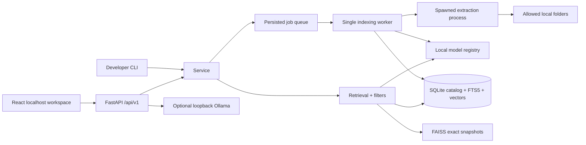

# Architecture and engineering decisions

## System boundaries

The service composes straightforward modules instead of introducing an ORM, message broker, external vector database, or an agent framework. The API and CLI share indexing/retrieval code. There is one worker and one process owner per catalog. A process lock prevents CLI/server overlap; a reentrant lock serializes search and publication of a revision. Expensive extraction/embedding runs before publication so search can continue between atomic changes.

## Catalog and provenance

SQLite is authoritative. Foreign keys connect `roots → files → file_revisions → chunks → embeddings`; an embedding points to an immutable profile that includes the model commit, dimension, modality, float32 normalization, instructions, and preprocessing identity. Profiles separate MiniLM/BGE text vectors from 512-dimensional CLIP vectors. `index_state` records the snapshot checksum and catalog generation. `jobs` and `job_errors` persist progress and actionable error codes. `schema_version` rejects unknown schemas rather than silently upgrading them.

A chunk has a kind, content hash, ordinal, text, symbol, optional preview asset, and JSON locator. PDF pages retain page numbers; code/text retain lines and character offsets; OCR retains word boxes; transcripts and frames retain millisecond intervals. Source IDs use AUTOINCREMENT so deleted IDs are not recycled into unrelated sources.

## Revision publication and recovery

1. Walk only allowlisted roots; skip links/reparse points and excluded paths. Capture stat data.
2. Skip unchanged `(size,mtime,pipeline)` entries; watcher events or full verification force SHA-256. Missing roots are marked unavailable and preserved. An incomplete walk never infers deletion.
3. Mark a changing file stale so its earlier revision cannot be returned as current.
4. Extract in a Windows-compatible spawned child. The parent enforces a time budget and polls cancellation; Windows termination includes the OCR child process tree. File size, decoded pixel count, media duration, and sampled frame count are bounded. This is timeout isolation, not an OS-enforced hard RAM sandbox.
5. Chunk by the actual local model tokenizer; enforce model length including special tokens. The lexical fallback uses regex token offsets. Preserve function boundaries when Java/Python parsing succeeds and line-safe fallback content otherwise.
6. Reuse text embeddings by `(profile,input hash)` and compute missing vectors in batches. Unchanged files skip all work; visual embeddings and media extraction are recomputed when their files require processing. CPU is the default; text OOM reduces batches, and text/CLIP inference falls back from CUDA to CPU. Media extraction uses a separate process so speech weights leave memory when it finishes.
7. Recheck stat and SHA-256. Publish revision, passages, FTS rows, profiles, and vectors in one SQLite transaction; remove earlier revision rows. A changed-during-extraction file fails visibly.
8. Increment index generation. On next use, build a new FAISS `IndexIDMap2(IndexFlatIP)` from active SQLite vectors, write a generation-named file, store its checksum, and retire earlier snapshots. Startup validates snapshots and reconstructs corrupt/missing/stale files.

Normalized inner product is cosine similarity. Exact FlatIP is deliberately simple for the initial target of ~100K chunks; ANN index tuning and its recall tradeoffs are deferred until representative scale measurements justify it. SQLite vector BLOBs increase disk usage, but make recovery independent of a fragile dual write to FAISS.

Restarted running jobs return to the queue and reconcile from the root. Cancellation preserves earlier completed files and discards the current uncommitted revision. Shutdown retains the process lock until the worker stops. Embedding batches are cooperative: shutdown may wait for the current batch. Forgetting a folder removes active catalog/FTS rows, deletes its unreferenced preview assets, clears in-memory indexes, and removes snapshots for regeneration; originals are untouched.

V2 automatic updates are controlled through `GET/PUT /api/v1/index/watch`. The session-protected PUT stores `watch_enabled` in `app_meta`; no schema migration is needed. A normal server launch restores that preference, while `serve --watch` or `--no-watch` overrides it for one run. The worker serializes observer lifecycle changes, ignores events from excluded/hidden/dependency paths and unsupported files, coalesces relevant events for one second, and hashes affected files even when metadata is unchanged. Directory move/create/delete hints force verification of descendants. Disabling watching stops new automatic jobs and clears pending hints; existing queued/running jobs continue.

Observer schedule/start failures, unavailable roots, and stopped emitter threads are visible in health/watch status. Full verification continues every 15 minutes when watching is enabled, and periodic reconciliation reattaches restored roots. Watcher events remain hints; the allowlisted scanner is authoritative. These scans traverse the selected roots and skip unchanged files rather than maintaining a second filesystem-event database.

## Retrieval

- Apply root, modality, extension, date, and escaped relative-path filters before ranking. FTS filters eligible IDs before LIMIT; filtered vector search scores eligible vectors exactly in bounded batches.
- FTS5 uses BM25 and extra weight for filenames/symbols. Query terms are literal tokens, preserving identifiers and adding camel-case splits. User input never becomes executable FTS syntax or SQL.
- Text semantic search uses normalized MiniLM or BGE vectors. BGE applies its query instruction only to queries.
- Default hybrid queries with one non-stopword require a literal FTS match and skip text/visual expansion. Longer hybrid queries require at least two distinct lexical terms for the lexical branch; strong semantic candidates can still match without any literal overlap. Explicit lexical mode retains OR-term behavior.
- Vector candidates are gated on raw cosine before fusion/reranking: MiniLM 0.35, BGE 0.55, CLIP 0.28. `Settings.min_text_similarity` and `min_vision_similarity` allow explicit overrides. Floors remain absolute under modality/root filters, so shrinking the candidate set cannot turn a weak first neighbor into a match. These are conservative model-specific heuristics, not calibrated relevance probabilities or a guarantee of correctness on every corpus.
- Hybrid combines lexical and semantic rank lists with reciprocal rank fusion (`k=60`). An optional MS MARCO cross-encoder reranks the first 20 text candidates.
- CLIP produces a separate visual branch. File-level fusion preserves lexical/semantic agreement instead of giving weak OCR matches two votes. CLIP weight is 0.35 in unrestricted search and 1.0 for explicitly image/video-filtered search. This is an initial engineering choice, not a learned or test-optimized threshold.
- Collapse by file, retain up to three distinct supporting excerpts, then collapse exact SHA-256 duplicates with eligible aliases. Raw similarities across model spaces are never compared directly.
- Hydrate full text only for candidate passages. Never report ranking scores as calibrated relevance confidence. No universal abstention threshold is claimed.

## OCR, video, and answers

Native Tesseract is used if installed; otherwise the Node/WebAssembly Tesseract fallback uses packaged English data and local engine paths. Neither path needs online OCR. Scanned PDF pages render through PDFium only when extracted text is empty. Image previews use EXIF-corrected thumbnails. Video sampling defaults to one frame every 10 seconds, suppresses near-identical average hashes, and caps frame counts. It cannot guarantee finding content between sampled frames.

Whisper uses the prepared English base model with local CTranslate2/PyAV decoding. Native HTML media controls seek to the supporting interval. Qwen through optional Ollama receives only bounded textual excerpts and evidence IDs; GPU embedding models are unloaded before generation. Citation checking detects missing or nonexistent IDs, not semantic entailment. Search remains usable when generation fails.

## Why these technologies

| Decision | Reason | Cost / alternative |
| --- | --- | --- |
| SQLite + FTS5 | Local transactions, useful BM25, no service administration | PostgreSQL unnecessary for a single user; FTS rank is corpus-relative |
| FAISS CPU exact | Transparent scoring/recovery; low setup burden | Approximate FAISS/Qdrant can be reconsidered after measured scale constraints |
| Sentence Transformers MiniLM | Small English baseline, 384-dimensional vectors | BGE is selectable for measurement; stronger models cost RAM/latency |
| CLIP ViT-B/32 | Practical local image/text alignment | OCR supplies exact screenshot terms; CLIP alone is weak on dense diagrams |
| Tesseract | Offline, free, provenance boxes | Errors remain possible; layout/table reconstruction is not attempted |
| faster-whisper base.en | Small, offline CPU-capable speech | Real noisy lectures need separately measured WER and recall |
| React + FastAPI | Accessible browser UI, typed contracts, inspectable Python modules | Desktop packaging/signing is deferred |

The default Python requirement is 3.11–3.13 because 3.11 was installed and successfully validated; the initial plan's 3.12-only assumption would unnecessarily block this machine.
